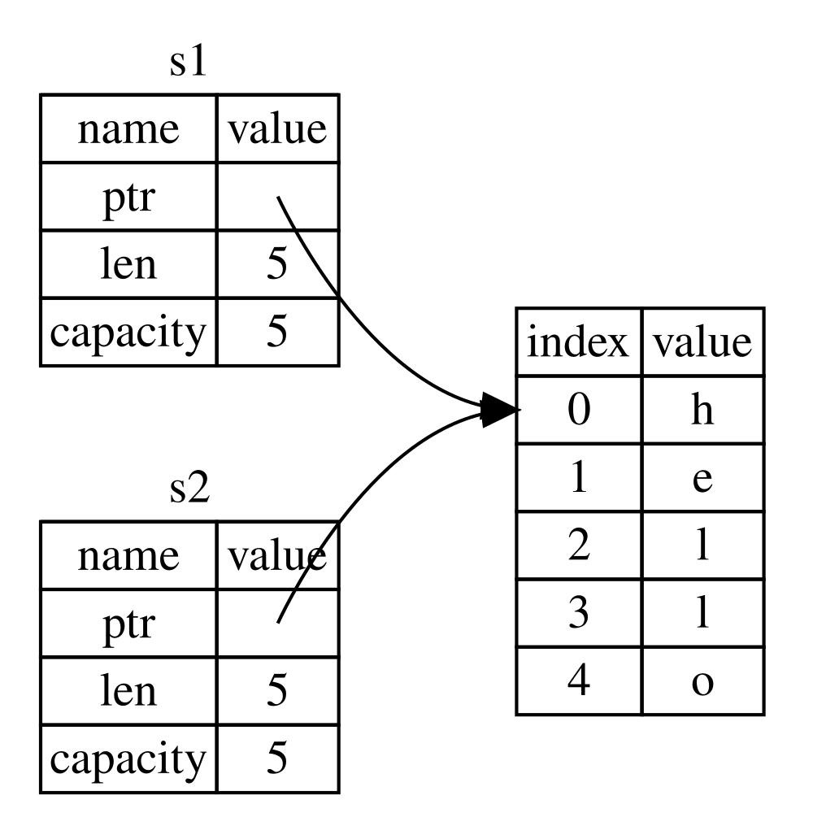
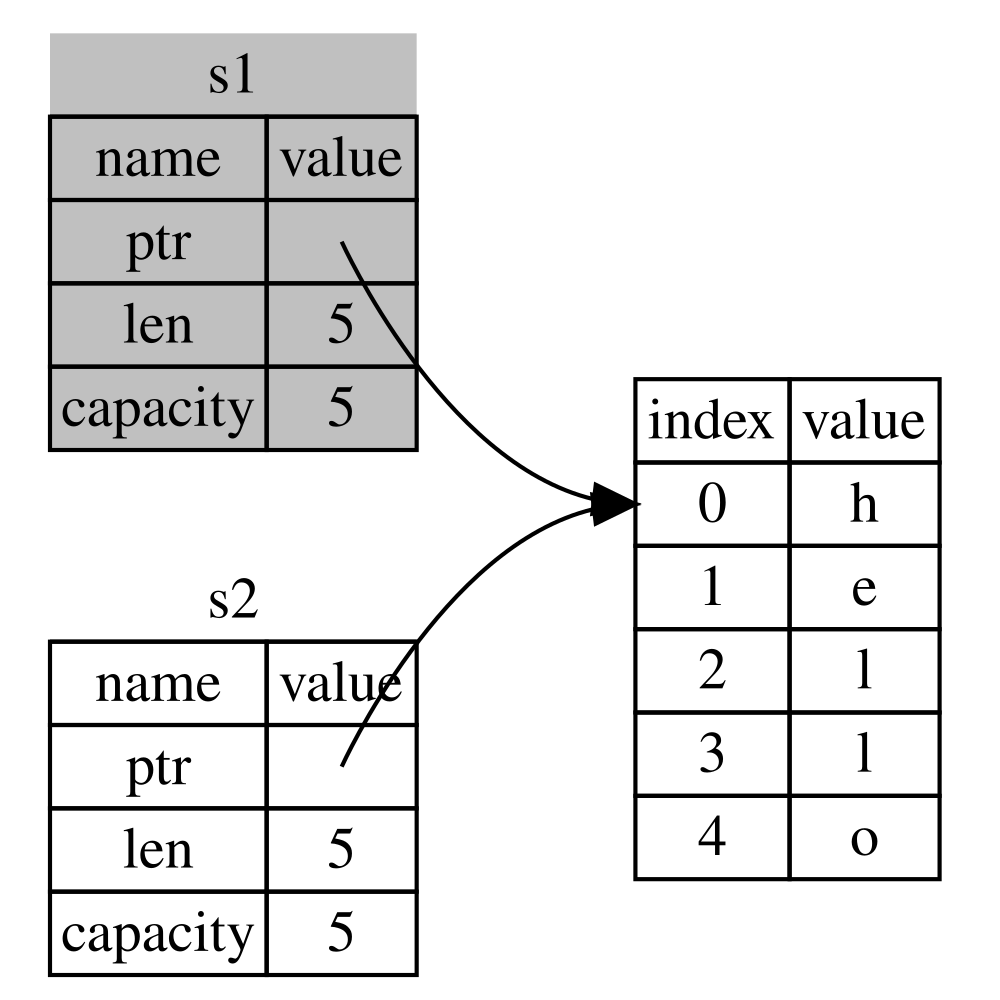

## Ownership কী?

_Ownership_ হলো এমন এক সেট নিয়ম যা নির্ধারণ করে একটি Rust program কীভাবে memory পরিচালনা করে। যেকোনো program-কেই চলাকালীন কম্পিউটারের memory ব্যবহারের পদ্ধতি পরিচালনা করতে হয়। কিছু ভাষায় garbage collection থাকে, যা program চলার সময় নিয়মিতভাবে আর ব্যবহৃত না হওয়া memory খুঁজে বের করে; আবার অন্য কিছু ভাষায় programmer-কে নিজে ম্যানুয়ালি memory allocate এবং free করতে হয়। Rust তৃতীয় একটি পদ্ধতি ব্যবহার করে: এক সেট নিয়ম সহ ownership-এর একটি system-এর মাধ্যমে memory পরিচালনা করা হয়, যে নিয়মগুলো compiler যাচাই করে। কোনো নিয়ম ভঙ্গ হলে program compile হবে না। Ownership-এর কোনো feature-ই তোমার program চলার সময় তাকে ধীর করবে না।

যেহেতু ownership অনেক programmer-এর কাছেই একটি নতুন concept, তাই এর সাথে অভ্যস্ত হতে কিছুটা সময় লাগে। ভালো খবর হলো, Rust এবং ownership system-এর নিয়মগুলোতে যত বেশি অভিজ্ঞ হবে, তত সহজেই তুমি স্বাভাবিকভাবে নিরাপদ ও efficient code লিখতে পারবে। ধৈর্য ধরো!

যখন তুমি ownership বুঝে যাবে, তখন Rust-কে unique করে তোলা এমন সব feature বোঝার জন্য তোমার কাছে একটি শক্ত ভিত্তি তৈরি হবে। এই chapter-এ তুমি কিছু উদাহরণের মধ্য দিয়ে ownership শিখবে, যেগুলো খুব সাধারণ একটি data structure-এর ওপর কেন্দ্র করে: string।

> ### Stack এবং Heap
>
> অনেক programming language-এ তোমাকে stack এবং heap নিয়ে খুব বেশি ভাবতে হয় না। কিন্তু Rust-এর মতো একটি systems programming language-এ, কোনো value stack-এ নাকি heap-এ আছে সেটি language-এর আচরণকে প্রভাবিত করে এবং কেন তোমাকে নির্দিষ্ট কিছু decision নিতে হয় তার কারণও ব্যাখ্যা করে। এই chapter-এ পরে ownership-এর কিছু অংশ stack ও heap-এর সাপেক্ষে বর্ণনা করা হবে, তাই প্রস্তুতি হিসেবে এখানে একটি সংক্ষিপ্ত ব্যাখ্যা দেওয়া হলো।
>
> Stack এবং heap দুটোই এমন memory-র অংশ যা তোমার code চলার সময় ব্যবহার করতে পারে, কিন্তু এদের গঠন আলাদা। Stack value গুলোকে যে ক্রমে পায় সেই ক্রমে সাজায় এবং উল্টো ক্রমে সরিয়ে দেয়। একে _last in, first out (LIFO)_ বলা হয়। এক স্তূপ plate-এর কথা ভাবো: তুমি যখন আরও plate যোগ করো, তখন সেগুলো স্তূপের ওপরে রাখো, আর যখন একটি plate দরকার হয়, তখন একটি ওপর থেকে তুলে নাও। মাঝখান বা নিচ থেকে plate যোগ বা সরানো সুবিধাজনক নয়! Data যোগ করাকে _pushing onto the stack_ এবং data সরানোকে _popping off the stack_ বলা হয়। Stack-এ সংরক্ষিত সব data-রই known, fixed size থাকতে হবে। Compile time-এ অজানা size বা পরিবর্তনশীল size-এর data অবশ্যই heap-এ রাখতে হবে।
>
> Heap তুলনামূলকভাবে কম সুসংগঠিত: তুমি যখন heap-এ data রাখো, তখন নির্দিষ্ট পরিমাণ জায়গার জন্য request করো। Memory allocator heap-এ এমন একটি ফাঁকা জায়গা খুঁজে বের করে যা যথেষ্ট বড়, সেটিকে ব্যবহৃত হিসেবে চিহ্নিত করে এবং একটি _pointer_ ফেরত দেয়, যা ওই জায়গার address। এই প্রক্রিয়াকে _allocating on the heap_ বলা হয় এবং সংক্ষেপে শুধু _allocating_ বলা হয় (stack-এ value push করাকে allocating ধরা হয় না)। যেহেতু heap-এর pointer একটি known, fixed size, তাই তুমি pointer-টি stack-এ রাখতে পারো, কিন্তু আসল data চাইলে তোমাকে pointer অনুসরণ করতে হবে। একটি রেস্তোরাঁয় বসার কথা ভাবো। তুমি ঢুকলে তোমার দলের লোকসংখ্যা বলো, আর হোস্ট এমন একটি ফাঁকা টেবিল খুঁজে বের করে যেখানে সবাই বসতে পারে এবং তোমাকে সেখানে নিয়ে যায়। যদি তোমার দলের কেউ দেরিতে আসে, সে জিজ্ঞেস করতে পারে তোমরা কোথায় বসেছ, আর তোমাকে খুঁজে নিতে পারে।
>
> Stack-ে push করা heap-এ allocate করার চেয়ে দ্রুত, কারণ allocator-কে নতুন data রাখার জায়গা খুঁজতে হয় না; সেই জায়গাটি সব সময় stack-এর ওপরেই থাকে। অন্যদিকে heap-এ জায়গা allocate করতে বেশি কাজ লাগে, কারণ allocator-কে প্রথমে data ধরার মতো যথেষ্ট বড় জায়গা খুঁজে বের করতে হয়, তারপর পরবর্তী allocation-এর জন্য প্রস্তুতি হিসেবে bookkeeping করতে হয়।
>
> Heap-এ data access করা সাধারণত stack-এর data access করার চেয়ে ধীর, কারণ সেখানে পৌঁছাতে তোমাকে একটি pointer অনুসরণ করতে হয়। আধুনিক processor যত কম memory-তে এদিক-ওদিক যায় তত দ্রুত কাজ করে। উপমাটি এগিয়ে নিয়ে যাই—একটি রেস্তোরাঁর পরিচারক কল্পনা করো যে অনেকগুলো টেবিল থেকে order নিচ্ছে। একটি টেবিলের সব order একসাথে নিয়ে পরের টেবিলে যাওয়াই সবচেয়ে efficient। টেবিল A থেকে একটি order নেওয়া, তারপর টেবিল B থেকে একটি order নেওয়া, আবার A থেকে, আবার B থেকে—এই প্রক্রিয়াটি অনেক ধীর হবে। একইভাবে, একটি processor সাধারণত তখন কাজ ভালো করতে পারে যখন সে এমন data নিয়ে কাজ করে যা অন্য data-র কাছাকাছি (যেমন stack-এ থাকে), দূরে নয় (যেমন heap-এ হতে পারে)।
>
> তোমার code যখন একটি function কল করে, তখন function-এ পাঠানো value গুলো (সম্ভবত heap-এর data-র pointer সহ) এবং function-এর local variable গুলো stack-এ push করা হয়। Function শেষ হলে সেই value গুলো stack থেকে pop করা হয়।
>
> Code-এর কোন অংশ heap-এর কোন data ব্যবহার করছে তা ট্র্যাক রাখা, heap-এ duplicate data-র পরিমাণ কমানো এবং জায়গা শেষ না হওয়ার জন্য অব্যবহৃত data পরিষ্কার করা—এই সবগুলোই এমন সমস্যা যা ownership সমাধান করে। একবার তুমি ownership বুঝলে তোমাকে আর বারবার stack আর heap নিয়ে ভাবতে হবে না। কিন্তু ownership-এর মূল উদ্দেশ্য যে heap data পরিচালনা করা—এটা জানলে ownership কেন এমনভাবে কাজ করে তা বুঝতে সুবিধা হয়।

### Ownership-এর নিয়ম

প্রথমে চলো ownership-এর নিয়মগুলো একবার দেখে নিই। যখন আমরা এই নিয়মগুলো ব্যাখ্যা করে এমন উদাহরণ গুলো নিয়ে কাজ করব, তখন এই নিয়মগুলো মাথায় রেখো:

- Rust-এ প্রতিটি value-র একজন _owner_ থাকে।
- একই সময়ে শুধু একজন owner থাকতে পারে।
- Owner যখন scope-এর বাইরে চলে যায়, value টি drop হয়ে যায়।

### Variable Scope

যেহেতু আমরা basic Rust syntax পেরিয়ে এসেছি, তাই এখন থেকে উদাহরণে আমরা পুরো `fn main() {` code দেব না, তাই তুমি যদি সাথে সাথে করো, তবে নিচের উদাহরণগুলো নিজে একটি `main` function-এর ভেতরে বসিয়ে নিশ্চিত করো। ফলে আমাদের উদাহরণগুলো কিছুটা ছোট হবে এবং boilerplate code-এর বদলে আসল বিষয়ে মনোযোগ দিতে পারব।

Ownership-এর প্রথম উদাহরণ হিসেবে কিছু variable-এর scope দেখি। _Scope_ হলো program-ের এমন একটি পরিসর যেখানে একটি item valid থাকে। নিচের variable-টি দেখো:

```rust
let s = "hello";
```

`s` variable-টি একটি string literal-কে নির্দেশ করে, যেখানে string-এর value টি আমাদের program-এর টেক্সটে হার্ডকোড করা। Variable-টি যেখানে declare করা হয়েছে সেখান থেকে বর্তমান scope-এর শেষ পর্যন্ত এটি valid। Listing 4-1 এমন একটি program দেখায় যেখানে comment দিয়ে চিহ্নিত করা হয়েছে যে `s` variable-টি কখন valid থাকবে।

<Listing number="4-1" caption="A variable and the scope in which it is valid">

```rust
    {                      // s is not valid here, since it's not yet declared
        let s = "hello";   // s is valid from this point forward

        // do stuff with s
    }                      // this scope is now over, and s is no longer valid
```

</Listing>

অন্য কথায়, এখানে দুটি গুরুত্বপূর্ণ সময় রয়েছে:

- `s` যখন scope-এ _আসে_, তখন এটি valid।
- এটি ততক্ষণ valid থাকে যতক্ষণ না এটি scope-এর _বাইরে_ চলে যায়।

এই পর্যায়ে scope এবং variable যখন valid থাকে তার মধ্যকার সম্পর্ক অন্যান্য programming language-এর মতোই। এবার আমরা `String` type পরিচয় করিয়ে দিয়ে এই বোঝাপড়ার ওপর ভিত্তি করে এগোব।

### `String` Type

Ownership-এর নিয়মগুলো বোঝাতে আমাদের এমন একটি data type দরকার যা Chapter 3-এর [“Data Types”][data-types]<!-- ignore --> section-এ আলোচিত type গুলোর চেয়ে বেশি জটিল। আগে আলোচিত type গুলোর known size আছে, সেগুলো stack-এ সংরক্ষণ করা যায় এবং scope শেষ হলে stack থেকে pop করা যায়, আর code-এর অন্য কোনো অংশ যদি অন্য scope-এ একই value ব্যবহার করতে চায় তবে সহজেই দ্রুত copy করে নতুন, independent instance তৈরি করা যায়। কিন্তু আমরা এমন data দেখতে চাই যা heap-এ সংরক্ষিত থাকে এবং Rust কখন সেই data পরিষ্কার করবে তা বুঝতে চাই—আর `String` type এর জন্য দারুণ একটি উদাহরণ।

আমরা `String`-এর যে অংশগুলো ownership-এর সাথে সম্পর্কিত সেগুলোর ওপর মনোযোগ দেব। এই দিকগুলো অন্যান্য জটিল data type-এর ক্ষেত্রেও প্রযোজ্য, সেগুলো standard library দিক থেকে আসুক বা তুমি নিজে তৈরি করো। `String`-এর ownership ব্যতীত অন্যান্য দিক আমরা [Chapter 8][ch8]<!-- ignore -->-তে আলোচনা করব।

আমরা ইতিমধ্যে string literal দেখেছি, যেখানে একটি string value আমাদের program-এ হার্ডকোড করা থাকে। String literal সুবিধাজনক, কিন্তু টেক্সট ব্যবহার করতে চাওয়া প্রতিটি পরিস্থিতির জন্য উপযুক্ত নয়। এর একটি কারণ হলো সেগুলো immutable। আরেকটি কারণ হলো, আমরা code লেখার সময় প্রতিটি string value জানা সম্ভব নয়: যেমন, আমরা যদি user input নিয়ে সেটি সংরক্ষণ করতে চাই তবে কী করব? এই ধরনের পরিস্থিতির জন্যই Rust-এ `String` type আছে। এই type heap-এ allocate করা data পরিচালনা করে এবং তাই compile time-ে আমাদের অজানা পরিমাণ টেক্সট সংরক্ষণ করতে সক্ষম। তুমি `from` function ব্যবহার করে একটি string literal থেকে `String` তৈরি করতে পারো, এভাবে:

```rust
let s = String::from("hello");
```

দুই কোলন `::` operator আমাদের এই নির্দিষ্ট `from` function-কে `String` type-এর অধীনে namespace করতে দেয়, `string_from`-এর মতো কোনো নাম ব্যবহারের বদলে। এই syntax নিয়ে আমরা Chapter 5-এর [“Methods”][methods]<!-- ignore --> section-এ আরও আলোচনা করব, এবং যখন Chapter 7-এর [“Paths for Referring to an Item in the Module Tree”][paths-module-tree]<!-- ignore -->-এ module-এর সাথে namespacing নিয়ে কথা বলব তখনও।

এই ধরনের string _পরিবর্তন করা যায়_:

```rust
    let mut s = String::from("hello");

    s.push_str(", world!"); // push_str() appends a literal to a String

    println!("{s}"); // this will print `hello, world!`
```

তাহলে, পার্থক্য কী? `String` কেন পরিবর্তন করা যায় কিন্তু literal কেন নয়? পার্থক্য লুকিয়ে আছে এই দুই type কীভাবে memory পরিচালনা করে তার মধ্যে।

### Memory এবং Allocation

String literal-এর ক্ষেত্রে, আমরা compile time-এই content জানি, তাই টেক্সটটি সরাসরি final executable-এ হার্ডকোড করা থাকে। এ কারণেই string literal দ্রুত এবং efficient। কিন্তু এই গুণগুলো আসে শুধুমাত্র string literal-এর immutability থেকে। দুর্ভাগ্যবশত, আমরা প্রতিটি টেক্সটের জন্য—যার size compile time-এ অজানা এবং যা program চলাকালীন পরিবর্তিত হতে পারে—আলাদা মেমরির blob binary-তে রাখতে পারি না।

`String` type-এর ক্ষেত্রে, mutable এবং বর্ধনযোগ্য টেক্সট সমর্থন করতে হলে, আমাদের heap-এ এমন পরিমাণ memory allocate করতে হয় যা compile time-এ অজানা—content ধরার জন্য। এর মানে হলো:

- Memory টি runtime-এ memory allocator-এর কাছে থেকে request করতে হবে।
- আমাদের `String` দিয়ে কাজ শেষ হলে সেই memory allocator-কে ফেরত দেওয়ার প্রয়োজন।

প্রথম অংশটি আমরা করি: যখন আমরা `String::from` কল করি, এর implementation প্রয়োজনীয় memory request করে। এটি programming language-গুলোতে বেশ সার্বজনীন।

তবে দ্বিতীয় অংশটি আলাদা। _Garbage collector (GC)_ সহ ভাষাগুলোতে, GC ব্যবহৃত না হওয়া memory ট্র্যাক রাখে ও পরিষ্কার করে, আমাদের এ নিয়ে ভাবতে হয় না। GC ছাড়া বেশিরভাগ ভাষায়, কখন memory আর ব্যবহৃত হচ্ছে না তা চিহ্নিত করা এবং স্পষ্টভাবে free করার জন্য code কল করা—এটা আমাদের দায়িত্ব, ঠিক যেমনটা request করার সময় করেছিলাম। এটি সঠিকভাবে করা ঐতিহাসিকভাবেই একটি কঠিন programming সমস্যা। ভুলে গেলে memory নষ্ট হবে। খুব আগেভাগে করলে invalid variable পাব। দু'বার করলেও সেটা bug। আমাদের ঠিক একটি `allocate`-এর সাথে ঠিক একটি `free` pair করতে হবে।

Rust ভিন্ন পথ বেছে নেয়: যে variable value-টির owner, সেটি scope-এর বাইরে গেলেই memory স্বয়ংক্রিয়ভাবে ফেরত দেওয়া হয়। নিচে Listing 4-1-এর scope উদাহরণের একটি সংস্করণ দেওয়া হলো যেখানে string literal-এর বদলে `String` ব্যবহার করা হয়েছে:

```rust
    {
        let s = String::from("hello"); // s is valid from this point forward

        // do stuff with s
    }                                  // this scope is now over, and s is no
                                       // longer valid
```

এমন একটি স্বাভাবিক মুহূর্ত আছে যেখানে আমরা আমাদের `String`-এর প্রয়োজনীয় memory allocator-কে ফেরত দিতে পারি: যখন `s` scope-এর বাইরে যায়। একটি variable যখন scope-এর বাইরে যায়, Rust আমাদের হয়ে একটি বিশেষ function কল করে। এই function-টির নাম `drop`, আর এখানেই `String`-এর লেখক memory ফেরত দেওয়ার code রাখতে পারেন। Rust শেষ closing curly bracket-এ স্বয়ংক্রিয়ভাবে `drop` কল করে।

> নোট: C++-এ, কোনো item-এর lifetime-এর শেষে resource deallocate করার এই pattern-কে মাঝে মাঝে _Resource Acquisition Is Initialization (RAII)_ বলা হয়। তুমি যদি RAII pattern ব্যবহার করে থাকো, তবে Rust-এর `drop` function তোমার কাছে পরিচিত মনে হবে।

এই pattern-এর Rust code লেখার ওপর গভীর প্রভাব রয়েছে। এখন মনে সহজ মনে হলেও, জটিল পরিস্থিতিতে—যেখানে আমরা একাধিক variable দিয়ে heap-এ allocate করা data ব্যবহার করতে চাই—code-এর আচরণ অপ্রত্যাশিত হতে পারে। চলো এখন সেই ধরনের কিছু পরিস্থিতি ঘেঁটে দেখি।

<!-- Old headings. Do not remove or links may break. -->

<a id="ways-variables-and-data-interact-move"></a>

#### Variable এবং Data-এর Move-এর মাধ্যমে মিথস্ক্রিয়া

Rust-এ একাধিক variable ভিন্ন ভিন্নভাবে একই data-এর সাথে মিথস্ক্রিয়া করতে পারে। Listing 4-2-তে একটি integer ব্যবহার করে এমন একটি উদাহরণ দেখানো হয়েছে।

<Listing number="4-2" caption="Assigning the integer value of variable `x` to `y`">

```rust
    let x = 5;
    let y = x;
```

</Listing>

আমরা সম্ভবত অনুমান করতে পারি এটি কী করছে: "`x`-এ value `5` bind করো; তারপর `x`-এর value-এর একটি copy নাও এবং সেটি `y`-এ bind করো।" এখন আমাদের দুটি variable আছে, `x` এবং `y`, দুটোরই value `5`। ব্যাপারটি আসলেই এমনটাই ঘটছে, কারণ integer হলো known, fixed size-এর সাধারণ value, এবং এই দুটি `5` value stack-এ push করা হয়।

এবার `String` সংস্করণটি দেখি:

```rust
    let s1 = String::from("hello");
    let s2 = s1;
```

এটি দেখতে খুব একই রকম, তাই আমরা ভাবতে পারি এটি একইভাবে কাজ করবে: অর্থাৎ দ্বিতীয় লাইনটি `s1`-এর value-এর একটি copy নেবে এবং সেটিকে `s2`-এ bind করবে। কিন্তু ব্যাপারটা ঠিক তেমন নয়।

`String`-এর ভেতরে কী হচ্ছে তা বোঝার জন্য Figure 4-1 দেখো। একটি `String` তিনটি অংশ নিয়ে গঠিত, যা বাঁ দিকে দেখানো হয়েছে: একটি pointer যা string-এর content ধারণ করা memory-কে নির্দেশ করে, একটি length এবং একটি capacity। এই data group-টি stack-এ সংরক্ষিত থাকে। ডান দিকে হলো সেই heap memory যা content ধরে রাখে।


<span class="caption">Figure 4-1: The representation in memory of a `String`
holding the value `"hello"` bound to `s1`</span>

Length হলো বর্তমানে `String`-এর content যতটুকু memory (byte-এ) ব্যবহার করছে। Capacity হলো মোট memory (byte-এ) যা `String` allocator-এর কাছ থেকে পেয়েছে। Length এবং capacity-এর পার্থক্য গুরুত্বপূর্ণ, কিন্তু এই context-এ নয়, তাই আপাতত capacity উপেক্ষা করতেই পারো।

যখন আমরা `s1`-কে `s2`-এ assign করি, `String` data টি copy হয়—অর্থাৎ আমরা stack-এ থাকা pointer, length এবং capacity copy করি। আমরা heap-এ থাকা data টি copy করি না যেটি pointer নির্দেশ করছে। অন্য কথায়, memory-তে data representation দেখতে Figure 4-2-এর মতো।



<span class="caption">Figure 4-2: The representation in memory of the variable
`s2` that has a copy of the pointer, length, and capacity of `s1`</span>

Representation টি Figure 4-3-এর মতো নয়, যেটি হতো যদি Rust heap data-ও copy করত। Rust যদি এমনটা করত, তবে heap-এ data বড় হলে `s2 = s1` operation-টি runtime performance-এর দিক থেকে খুব ব্যয়বহুল হতে পারত।


<span class="caption">Figure 4-3: Another possibility for what `s2 = s1` might
do if Rust copied the heap data as well</span>

আগেই বলেছিলাম, একটি variable scope-এর বাইরে গেলে Rust স্বয়ংক্রিয়ভাবে `drop` function কল করে এবং ওই variable-এর heap memory পরিষ্কার করে। কিন্তু Figure 4-2 দেখায় দুটি data pointer-ই একই জায়গা নির্দেশ করছে। এটি একটি সমস্যা: যখন `s2` এবং `s1` scope-এর বাইরে যাবে, তখন দুটোই একই memory free করার চেষ্টা করবে। এটি _double free_ error নামে পরিচিত এবং এটি আগে উল্লেখিত memory safety bug-গুলোর একটি। Memory দু'বার free করা memory corruption ঘটাতে পারে, যা সম্ভাব্য security vulnerability-তে রূপ নিতে পারে।

Memory safety নিশ্চিত করতে, `let s2 = s1;` লাইনের পরে Rust `s1`-কে আর valid বিবেচনা করে না। ফলে `s1` scope-এর বাইরে গেলে Rust-কে আর কিছু free করতে হয় না। দেখো কী হয় যখন তুমি `s2` তৈরির পরে `s1` ব্যবহার করার চেষ্টা করো; এটা কাজ করবে না:

```rust,ignore,does_not_compile
    let s1 = String::from("hello");
    let s2 = s1;

    println!("{s1}, world!");
```

তুমি এমন একটি error পাবে কারণ Rust তোমাকে invalidated reference ব্যবহার করতে দেয় না:

```console
$ cargo run
   Compiling ownership v0.1.0 (file:///projects/ownership)
error[E0382]: borrow of moved value: `s1`
 --> src/main.rs:5:16
  |
2 |     let s1 = String::from("hello");
  |         -- move occurs because `s1` has type `String`, which does not implement the `Copy` trait
3 |     let s2 = s1;
  |              -- value moved here
4 |
5 |     println!("{s1}, world!");
  |                ^^ value borrowed here after move
  |
help: consider cloning the value if the performance cost is acceptable
  |
3 |     let s2 = s1.clone();
  |                ++++++++

For more information about this error, try `rustc --explain E0382`.
error: could not compile `ownership` (bin "ownership") due to 1 previous error
```

তুমি যদি অন্য ভাষায় কাজ করার সময় _shallow copy_ এবং _deep copy_ শব্দ দুটি শুনে থাকো, তবে data copy না করে শুধু pointer, length এবং capacity copy করার concept-টা shallow copy করার মতোই শোনাবে। কিন্তু যেহেতু Rust প্রথম variable-কে invalidate ও করে, তাই একে shallow copy না বলে _move_ বলা হয়। এই উদাহরণে আমরা বলতে পারি যে `s1`-কে `s2`-এ _move_ করা হয়েছে। তাই আসলে যা ঘটে তা Figure 4-4-এ দেখানো হয়েছে।



<span class="caption">Figure 4-4: The representation in memory after `s1` has
been invalidated</span>

এতে আমাদের সমস্যার সমাধান হয়ে গেল! শুধুমাত্র `s2` valid থাকায়, এটি scope-ের বাইরে গেলে একাই memory free করবে, আর আমাদের কাজ শেষ।

এছাড়াও, এতে এমন একটি design choice অন্তর্নিহিত আছে: Rust কখনোই স্বয়ংক্রিয়ভাবে তোমার data-এর "deep" copy তৈরি করবে না। ফলে যেকোনো _স্বয়ংক্রিয়_ copying কে runtime performance-এর দিক থেকে সস্তা ধরে নেওয়া যায়।

#### Scope এবং Assignment

Scoping, ownership এবং `drop` function-এর মাধ্যমে memory free হওয়ার সম্পর্কের ক্ষেত্রে উল্টোটাও সত্য। তুমি যখন কোনো বিদ্যমান variable-কে সম্পূর্ণ নতুন একটি value assign করো, Rust `drop` কল করে এবং original value-এর memory সাথে সাথে free করে দেয়। যেমন এই code-টি দেখো:

```rust
    let mut s = String::from("hello");
    s = String::from("ahoy");

    println!("{s}, world!");
```

আমরা প্রথমে `s` নামে একটি variable declare করে সেটিকে `"hello"` value সহ একটি `String`-এ bind করি। তারপর আমরা সাথে সাথেই `"ahoy"` value সহ একটি নতুন `String` তৈরি করে `s`-এ assign করি। এই মুহূর্তে heap-এর original value-কে কিছুই নির্দেশ করছে না। Figure 4-5-এ এখনকার stack এবং heap data দেখানো হলো:


<span class="caption">Figure 4-5: The representation in memory after the initial
value has been replaced in its entirety</span>

ফলে original string সাথে সাথেই scope-ের বাইরে চলে যায়। Rust তার ওপর `drop` function চালায় এবং তার memory সাথে সাথে free হয়ে যায়। শেষে আমরা যখন value টি print করব, তখন সেটি হবে `"ahoy, world!"`।

<!-- Old headings. Do not remove or links may break. -->

<a id="ways-variables-and-data-interact-clone"></a>

#### Variable এবং Data-এর Clone-এর মাধ্যমে মিথস্ক্রিয়া

আমরা যদি শুধু stack data নয়, `String`-এর heap data-ও গভীরভাবে copy করতে চাই, তবে আমরা `clone` নামের একটি সাধারণ method ব্যবহার করতে পারি। Method syntax নিয়ে আমরা Chapter 5-এ আলোচনা করব, কিন্তু যেহেতু method অনেক programming language-েই সাধারণ একটি feature, তাই তুমি সম্ভবত আগেও দেখেছ।

এখানে `clone` method-এর কাজ করার একটি উদাহরণ দেওয়া হলো:

```rust
    let s1 = String::from("hello");
    let s2 = s1.clone();

    println!("s1 = {s1}, s2 = {s2}");
```

এটি নিখুঁতভাবে কাজ করে এবং স্পষ্টভাবে Figure 4-3-এ দেখানো আচরণ তৈরি করে, যেখানে heap data আসলেই copy হয়।

তুমি যখন `clone`-এ কোনো কল দেখো, তুমি বুঝতে পারো যে কিছু অজানা code execute হচ্ছে এবং সেই code ব্যয়বহুল হতে পারে। এটি একটি দৃশ্যমান ইঙ্গিত যে কিছু ভিন্ন ঘটছে।

#### শুধু Stack-এ থাকা Data: Copy

এখনো আলোচনা না করা আরেকটি বিষয় আছে। নিচের integer ব্যবহার করা code-টি—যার অংশ Listing 4-2-তে দেখানো হয়েছিল—কাজ করে এবং valid:

```rust
    let x = 5;
    let y = x;

    println!("x = {x}, y = {y}");
```

কিন্তু এই code-টি মনে হয় আমরা যা এইমাত্র শিখলাম তার সাথে সাংঘর্ষিক: আমরা `clone`-এ কোনো কল দিইনি, কিন্তু `x` এখনো valid এবং `y`-এ move করেনি।

কারণ হলো, integer-এর মতো যে type-গুলোর compile time-এ known size আছে সেগুলো সম্পূর্ণভাবে stack-এ সংরক্ষিত থাকে, তাই আসল value-এর copy করা দ্রুত হয়। ফলে `y` variable তৈরি করার পরও `x`-কে valid থাকতে না দেওয়ার কোনো কারণ নেই। অন্য কথায়, এখানে deep এবং shallow copy-এর মধ্যে কোনো পার্থক্য নেই, তাই `clone` কল করলে স্বাভাবিক shallow copy-এর চেয়ে কিছু আলাদা করত না, আর তাই আমরা সেটি বাদ দিতে পারি।

Rust-এ `Copy` trait নামে একটি বিশেষ annotation আছে যা আমরা stack-এ সংরক্ষিত type-গুলোর ওপর রাখতে পারি, ঠিক যেমন integer (trait নিয়ে আমরা [Chapter 10][traits]<!-- ignore -->-তে আরও আলোচনা করব)। কোনো type যদি `Copy` trait implement করে, তবে সেটি ব্যবহার করে এমন variable move করে না, বরং trivially copy হয়, ফলে অন্য variable-এ assign করার পরেও সেগুলো valid থাকে।

Rust কোনো type-কে `Copy` দিয়ে annotate করতে দেবে না যদি সেই type, বা তার কোনো অংশ, `Drop` trait implement করে থাকে। যদি type-টির value scope-এর বাইরে গেলে কিছু বিশেষ করা প্রয়োজন হয় এবং আমরা সেই type-এ `Copy` annotation যোগ করি, তবে আমরা একটি compile-time error পাব। তোমার type-এ `Copy` annotation যোগ করে trait implement করার জন্য কীভাবে দেখতে হয় তা জানতে Appendix C-এর [“Derivable Traits”][derivable-traits]<!-- ignore --> দেখো।

তাহলে কোন কোন type `Copy` trait implement করে? নিশ্চিত হতে তুমি নির্দিষ্ট type-এর documentation দেখতে পারো, তবে সাধারণ নিয়ম হিসেবে, simple scalar value-গুলোর যেকোনো group `Copy` implement করতে পারে, আর allocation বা কোনো resource আকারে যা প্রয়োজন তা `Copy` implement করতে পারে না। নিচে কিছু type দেওয়া হলো যেগুলো `Copy` implement করে:

- সব integer type, যেমন `u32`।
- Boolean type, `bool`, যার value `true` এবং `false`।
- সব floating-point type, যেমন `f64`।
- Character type, `char`।
- Tuple, যদি সেগুলোতে শুধু `Copy` implement করা type থাকে। যেমন, `(i32, i32)` `Copy` implement করে, কিন্তু `(i32, String)` করে না।

### Ownership এবং Function

কোনো function-এ value পাঠানোর mechanics গুলো value কে variable-এ assign করার মতোই। কোনো variable-কে function-এ পাঠালে তা assign করার মতোই move বা copy হবে। Listing 4-3-তে কিছু annotation সহ এমন একটি উদাহরণ দেখানো হয়েছে যা দেখায় কখন variable গুলো scope-এ আসে আর বাইরে যায়।

<Listing number="4-3" file-name="src/main.rs" caption="Functions with ownership and scope annotated">

```rust
fn main() {
    let s = String::from("hello");  // s comes into scope

    takes_ownership(s);             // s's value moves into the function...
                                    // ... and so is no longer valid here

    let x = 5;                      // x comes into scope

    makes_copy(x);                  // Because i32 implements the Copy trait,
                                    // x does NOT move into the function,
                                    // so it's okay to use x afterward.

} // Here, x goes out of scope, then s. However, because s's value was moved,
  // nothing special happens.

fn takes_ownership(some_string: String) { // some_string comes into scope
    println!("{some_string}");
} // Here, some_string goes out of scope and `drop` is called. The backing
  // memory is freed.

fn makes_copy(some_integer: i32) { // some_integer comes into scope
    println!("{some_integer}");
} // Here, some_integer goes out of scope. Nothing special happens.
```

</Listing>

`takes_ownership` কল করার পরে আমরা যদি `s` ব্যবহার করার চেষ্টা করতাম, Rust একটি compile-time error ছুঁড়ত। এই static check গুলো আমাদের ভুল থেকে রক্ষা করে। `main`-এ এমন code যোগ করে দেখো যা `s` এবং `x` ব্যবহার করে, যাতে বুঝতে পারো কোথায় সেগুলো ব্যবহার করতে পারো আর কোথায় ownership নিয়ম তোমাকে বারণ করে।

### Return Value এবং Scope

Value ফেরত দিলেও ownership transfer হতে পারে। Listing 4-4-তে এমন একটি function-এর উদাহরণ দেখানো হয়েছে যা কোনো value ফেরত দেয়, Listing 4-3-এর মতো একই ধরনের annotation সহ।

<Listing number="4-4" file-name="src/main.rs" caption="Transferring ownership of return values">

```rust
fn main() {
    let s1 = gives_ownership();        // gives_ownership moves its return
                                       // value into s1

    let s2 = String::from("hello");    // s2 comes into scope

    let s3 = takes_and_gives_back(s2); // s2 is moved into
                                       // takes_and_gives_back, which also
                                       // moves its return value into s3
} // Here, s3 goes out of scope and is dropped. s2 was moved, so nothing
  // happens. s1 goes out of scope and is dropped.

fn gives_ownership() -> String {       // gives_ownership will move its
                                       // return value into the function
                                       // that calls it

    let some_string = String::from("yours"); // some_string comes into scope

    some_string                        // some_string is returned and
                                       // moves out to the calling
                                       // function
}

// This function takes a String and returns a String.
fn takes_and_gives_back(a_string: String) -> String {
    // a_string comes into
    // scope

    a_string  // a_string is returned and moves out to the calling function
}
```

</Listing>

কোনো variable-এর ownership প্রতিবার একই pattern অনুসরণ করে: অন্য variable-এ value assign করলে তা move হয়। যখন heap-এ data সহ কোনো variable scope-এর বাইরে যায়, তখন `drop`-এর মাধ্যমে তার value পরিষ্কার করা হয়, যদি না সেই data-এর ownership অন্য কোনো variable-এ move করা হয়।

যদিও এটি কাজ করে, প্রতিটি function-এ ownership নেওয়া এবং তা আবার ফেরত দেওয়া কিছুটা ক্লান্তিকর। যদি আমরা চাই একটি function কোনো value ব্যবহার করুক কিন্তু ownership না নেয়? বিরক্তিকর ব্যাপার হলো, আমরা যা পাস করি তা যদি আবার ব্যবহার করতে চাই তবে তা আবার ফেরত নিতে হয়, সেই সাথে function-এর body থেকে পাওয়া অন্য কোনো data ফেরত দিতে চাইলে তাও।

Rust আমাদের tuple ব্যবহার করে একাধিক value ফেরত দিতে দেয়, যেমনটা Listing 4-5-তে দেখানো হয়েছে।

<Listing number="4-5" file-name="src/main.rs" caption="Returning ownership of parameters">

```rust
fn main() {
    let s1 = String::from("hello");

    let (s2, len) = calculate_length(s1);

    println!("The length of '{s2}' is {len}.");
}

fn calculate_length(s: String) -> (String, usize) {
    let length = s.len(); // len() returns the length of a String

    (s, length)
}
```

</Listing>

কিন্তু এটি অনেক বাড়াবাড়ি, এবং এমন একটি concept-এর জন্য—যা সাধারণ হওয়া উচিত—অনেক বেশি কাজ। আমাদের সৌভাগ্য যে Rust-এ ownership transfer না করে value ব্যবহারের একটি feature আছে: reference।

[data-types]: ch03-02-data-types.html#data-types
[ch8]: ch08-02-strings.html
[traits]: ch10-02-traits.html
[derivable-traits]: appendix-03-derivable-traits.html
[methods]: ch05-03-method-syntax.html#methods
[paths-module-tree]: ch07-03-paths-for-referring-to-an-item-in-the-module-tree.html
