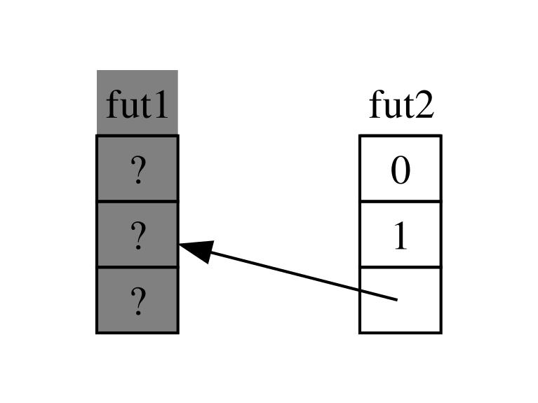

<!-- Old headings. Do not remove or links may break. -->

<a id="digging-into-the-traits-for-async"></a>

## Async-এর Trait গুলো নিয়ে আরেকটু কাছ থেকে দেখা

Chapter জুড়ে আমরা `Future`, `Stream`, এবং `StreamExt` trait গুলো বিভিন্নভাবে ব্যবহার করেছি। তবে এতকণ আমরা এগুলো কীভাবে কাজ করে বা কীভাবে একসাথে মেশে, সেদিকে বিস্তারিত যাওয়া এড়িয়েছি, যা day-to-day Rust কাজের জন্য বেশিরভাগ সময়েই যথেষ্ট। তবে মাঝে মাঝে তুমি এমন পরিস্থিতিতে পড়বে যেখানে এই trait-গুলোর আরও কিছু বিস্তারিত বুঝতে হবে, সাথে `Pin` type এবং `Unpin` trait-ও। এই section-এ আমরা ঠিক ততটুকুই খুঁড়ি, যা সেই পরিস্থিতিতে সাহায্য করবে, _সত্যিকারের_ গভীর আলোচনা অন্য documentation-এর জন্য রেখে।

<!-- Old headings. Do not remove or links may break. -->

<a id="future"></a>

### `Future` Trait

চলো শুরু করি `Future` trait কীভাবে কাজ করে তা আরেকটু কাছ থেকে দেখে। Rust এটিকে যেভাবে define করে:

```rust
use std::pin::Pin;
use std::task::{Context, Poll};

pub trait Future {
    type Output;

    fn poll(self: Pin<&mut Self>, cx: &mut Context<'_>) -> Poll<Self::Output>;
}
```

এই trait definition-এ বেশ কিছু নতুন type এবং আগে না দেখা কিছু syntax আছে, তাই চলো definition-টি অংশে অংশে দেখি।

প্রথমত, `Future`-এর associated type `Output` বোঝায় future যা-তে resolve হয়। এটি `Iterator` trait-এর `Item` associated type-এর সমতুল্য। দ্বিতীয়ত, `Future`-এর `poll` method আছে, যা তার `self` parameter-এর জন্য একটি বিশেষ `Pin` reference এবং একটি `Context` type-এর mutable reference নেয়, এবং `Poll<Self::Output>` return করে। `Pin` ও `Context` নিয়ে আমরা একটু পরেই আরও কথা বলব। এখন, চলো method যা return করে সেই `Poll` type-এ মনোযোগ দিই:

```rust
pub enum Poll<T> {
    Ready(T),
    Pending,
}
```

এই `Poll` type `Option`-এর মতোই। এর একটি variant-এ value থাকে, `Ready(T)`, আর একটিতে থাকে না, `Pending`। তবে `Poll`-এর অর্থ `Option`-এর চেয়ে একেবারেই আলাদা! `Pending` variant নির্দেশ করে যে future-এর এখনও কাজ বাকি, তাই caller-কে পরে আবার check করতে হবে। `Ready` variant নির্দেশ করে যে `Future` তার কাজ শেষ করেছে এবং `T` value available।

> Note: `poll` সরাসরি call করার প্রয়োজন খুব কমই হয়, কিন্তু যদি তোমার করতেই হয়, তবে মাথায় রাখবে যে বেশিরভাগ future-এর ক্ষেত্রে caller-এর `Ready` return হওয়ার পরে আবার `poll` call করা উচিত নয়। অনেক future `Ready` হওয়ার পরে আবার poll করলে panic করবে। যেগুলো আবার poll করা নিরাপদ তারা তাদের documentation-এ স্পষ্টভাবে বলবে। এটি `Iterator::next` যেভাবে আচরণ করে তার সাথে সাদৃশ্যপূর্ণ।

তুমি যখন `await` ব্যবহার করা কোড দেখো, Rust পর্দার আড়ালে সেটিকে `poll` call করা কোডে compile করে। Listing 17-4-এর কথা মনে করো, যেখানে আমরা একটি single URL-এর page title একবার resolve হলে print করেছিলাম, Rust সেটিকে এমন কিছুতে compile করে (যদিও হুবহু এইরকম নয়):

```rust,ignore
match page_title(url).poll() {
    Ready(page_title) => match page_title {
        Some(title) => println!("The title for {url} was {title}"),
        None => println!("{url} had no title"),
    }
    Pending => {
        // But what goes here?
    }
}
```

future যখন এখনও `Pending` থাকে তখন আমাদের কী করা উচিত? আমাদের এমন কোনো উপায় দরকার যাতে আমরা বারবার, আবার আবার চেষ্টা করতে পারি, যতক্ষণ না future অবশেষে ready হয়। অন্য কথায়, আমাদের একটি loop দরকার:

```rust,ignore
let mut page_title_fut = page_title(url);
loop {
    match page_title_fut.poll() {
        Ready(value) => match page_title {
            Some(title) => println!("The title for {url} was {title}"),
            None => println!("{url} had no title"),
        }
        Pending => {
            // continue
        }
    }
}
```

কিন্তু Rust যদি হুবহু সেই কোডে compile করত, তবে প্রতিটি `await` blocking হতো—যা আমরা যা চাই তার ঠিক উল্টো! বরং Rust নিশ্চিত করে যে loop-টি এমন কোনো কিছুতে control হস্তান্তর করতে পারে যা এই future-এ কাজ pause করে অন্য future-এ কাজ করতে পারে এবং পরে আবার এই future চেক করতে পারে। যেমন আমরা দেখেছি, সেই কিছু-টি হলো একটি async runtime, আর এই scheduling ও coordination-এর কাজ তার প্রধান কাজের একটি।

[“Sending Data Between Two Tasks Using Message Passing”][message-passing]<!-- ignore --> section-এ আমরা `rx.recv`-এর অপেক্ষা করা নিয়ে বর্ণনা করেছি। `recv` call একটি future return করে, এবং সেই future-টি await করলে তাকে poll করা হয়। আমরা উল্লেখ করেছিলাম যে runtime future-টিকে ready না হওয়া পর্যন্ত pause করে রাখবে, হয় `Some(message)` অথবা channel close হলে `None` দিয়ে। `Future` trait সম্পর্কে আমাদের গভীর বোঝার সাথে, বিশেষ করে `Future::poll`-এর সাথে, আমরা দেখতে পাই কীভাবে সেটা কাজ করে। Runtime জানে যে future তখন `Poll::Pending` return করলে ready নয়। অন্যদিকে, `poll` যখন `Poll::Ready(Some(message))` বা `Poll::Ready(None)` return করে, তখন runtime জানে future ready এবং তাকে এগিয়ে নিয়ে যায়।

একটি runtime কীভাবে সেটা করে তার সঠিক বিস্তারিত এই book-এর scope-এর বাইরে, তবে মূল বিষয় হলো future-গুলোর মৌলিক যান্ত্রিকতা দেখা: একটি runtime তার অধীনস্থ প্রতিটি future-কে _poll_ করে, এবং future যখন এখনও ready না হয় তখন তাকে আবার sleep করিয়ে দেয়।

<!-- Old headings. Do not remove or links may break. -->

<a id="pinning-and-the-pin-and-unpin-traits"></a>
<a id="the-pin-and-unpin-traits"></a>

### `Pin` Type এবং `Unpin` Trait

Listing 17-13-তে আমরা তিনটি future await করতে `trpl::join!` macro ব্যবহার করেছিলাম। তবে একটি vector-এর মতো collection-এ কিছু সংখ্যক future রাখা, যা সংখ্যা runtime না এসে জানা যাবে না—এমনটা খুব সাধারণ। চলো Listing 17-13-কে Listing 17-23-এর কোডে পরিবর্তন করি, যা তিনটি future-কে একটি vector-এ রেখে `trpl::join_all` function call করে, যা এখনও compile হয় না।

<Listing number="17-23" caption="Awaiting futures in a collection"  file-name="src/main.rs">

```rust,ignore,does_not_compile
        let tx_fut = async move {
            // --snip--
        };

        let futures: Vec<Box<dyn Future<Output = ()>>> =
            vec![Box::new(tx1_fut), Box::new(rx_fut), Box::new(tx_fut)];

        trpl::join_all(futures).await;
```

</Listing>

আমরা প্রতিটি future-কে একটি `Box`-এ রাখি তাদের _trait object_-এ পরিণত করতে, ঠিক যেমন Chapter 12-এর “Returning Errors from `run`” section-এ করেছিলাম। (আমরা trait object নিয়ে Chapter 18-এ বিস্তারিত আলোচনা করব।) Trait object ব্যবহার করলে এই type-গুলোর দ্বারা উৎপন্ন প্রতিটি anonymous future-কে একই type হিসেবে বিবেচনা করা যায়, কারণ তারা সবাই `Future` trait ইমপ্লিমেন্ট করে।

এটা হয়তো অবাক করবে। সবশেষে, async block-গুলোর কোনোটিই কিছু return করে না, তাই প্রতিটি একটি `Future<Output = ()>` উৎপন্ন করে। তবে মনে রেখো, `Future` হলো একটি trait, এবং compiler প্রতিটি async block-এর জন্য একটি অনন্য enum তৈরি করে, এমনকি যখন তাদের output type একই থাকে। ঠিক যেমন তুমি দুটি আলাদা হাতে লেখা struct-কে একটি `Vec`-এ রাখতে পারো না, তেমনি তুমি compiler-উৎপন্ন enum-গুলোকে মেশাতে পারবে না।

তারপর আমরা future-গুলোর collection-টি `trpl::join_all` function-কে দিই এবং result await করি। তবে এটি compile হয় না; error message-গুলোর প্রাসঙ্গিক অংশ নিচে দেওয়া হলো।

<!-- manual-regeneration
cd listings/ch17-async-await/listing-17-23
cargo build
copy *only* the final `error` block from the errors
-->

```text
error[E0277]: `dyn Future<Output = ()>` cannot be unpinned
  --> src/main.rs:48:33
   |
48 |         trpl::join_all(futures).await;
   |                                 ^^^^^ the trait `Unpin` is not implemented for `dyn Future<Output = ()>`
   |
   = note: consider using the `pin!` macro
           consider using `Box::pin` if you need to access the pinned value outside of the current scope
   = note: required for `Box<dyn Future<Output = ()>>` to implement `Future`
note: required by a bound in `futures_util::future::join_all::JoinAll`
  --> file:///home/.cargo/registry/src/index.crates.io-1949cf8c6b5b557f/futures-util-0.3.30/src/future/join_all.rs:29:8
   |
27 | pub struct JoinAll<F>
   |            ------- required by a bound in this struct
28 | where
29 |     F: Future,
   |        ^^^^^^ required by this bound in `JoinAll`
```

এই error message-এর note-টি বলছে যে আমাদের value-গুলোকে _pin_ করতে `pin!` macro ব্যবহার করা উচিত, যার মানে সেগুলোকে `Pin` type-এর ভেতরে রাখা যা guarantee করে value-গুলো memory-তে move হবে না। Error message বলছে pinning প্রয়োজন কারণ `dyn Future<Output = ()>`-কে `Unpin` trait ইমপ্লিমেন্ট করতে হবে কিন্তু বর্তমানে সে করে না।

`trpl::join_all` function `JoinAll` নামের একটি struct return করে। সেই struct একটি `F` type-এর ওপর generic, যা `Future` trait ইমপ্লিমেন্ট করতে বাধ্য। কোনো future-কে সরাসরি `await` দিয়ে await করলে future-টিকে implicitly pin করা হয়। এটাই কারণ আমরা যেখানে future await করতে চাই সবখানে `pin!` ব্যবহার করি না।

তবে আমরা এখানে সরাসরি কোনো future await করছি না। বরং আমরা `join_all` function-এ future-গুলোর একটি collection দিয়ে নতুন একটি future, JoinAll, তৈরি করছি। `join_all`-এর signature-এ বাধ্য করা হয়েছে যে collection-এর item-গুলোর type সবাই `Future` trait ইমপ্লিমেন্ট করবে, কিন্তু `Box<T>` তখনই `Future` ইমপ্লিমেন্ট করে যখন তার wrap করা `T` এমন একটি future যা `Unpin` trait ইমপ্লিমেন্ট করে।

এটা বুঝতে অনেক কিছু! সত্যিই বুঝতে হলে, চলো `Future` trait আসলে কীভাবে কাজ করে, বিশেষ করে pinning নিয়ে, আরেকটু গভীরে যাই। আবার `Future` trait-এর definition-টি দেখো:

```rust
use std::pin::Pin;
use std::task::{Context, Poll};

pub trait Future {
    type Output;

    // Required method
    fn poll(self: Pin<&mut Self>, cx: &mut Context<'_>) -> Poll<Self::Output>;
}
```

`cx` parameter ও তার `Context` type হলো key কীভাবে একটি runtime আসলে lazy থেকে যেকোনো নির্দিষ্ট future কখন check করবে তা জানে। আবার, এটি কীভাবে কাজ করে তার বিস্তারিত এই chapter-এর scope-এর বাইরে, এবং সাধারণত তুমি এটা নিয়ে তখনই ভাববে যখন কোনো custom `Future` ইমপ্লিমেন্টেশন লিখবে। আমরা বরং `self`-এর type-এ মনোযোগ দেব, কারণ এটাই প্রথম আমরা এমন একটি method দেখছি যেখানে `self`-এর একটি type annotation আছে। `self`-এর type annotation অন্যান্য function parameter-এর type annotation-এর মতোই কাজ করে, কিন্তু দুটি মূল পার্থক্য আছে:

- এটি Rust-কে বলে method-টি call করতে হলে `self`-এর কী type হতে হবে।
- এটি যেকোনো type হতে পারে না। এটি সীমাবদ্ধ শুধু সেই type যেখানে method-টি ইমপ্লিমেন্ট করা, তার reference বা smart pointer, অথবা reference-টিকে wrap করা একটি `Pin`।

এই syntax নিয়ে আমরা [Chapter 18][ch-18]<!-- ignore -->-তে আরও দেখব। এখন, এটুকু জানাই যথেষ্ট যে যদি আমরা কোনো future-কে `Pending` কি `Ready(Output)` তা check করতে poll করতে চাই, তাহলে আমাদের সেই type-এর একটি `Pin`-wrap করা mutable reference দরকার।

`Pin` হলো `&`, `&mut`, `Box`, এবং `Rc`-র মতো pointer-সদৃশ type-গুলোর জন্য একটি wrapper। (technically, `Pin` এমন type-গুলোর সাথে কাজ করে যা `Deref` বা `DerefMut` trait ইমপ্লিমেন্ট করে, কিন্তু এটি effectively reference ও smart pointer-এর সাথেই কাজ করার সমতুল্য।) `Pin` নিজে কোনো pointer নয় এবং `Rc` ও `Arc`-র reference counting-এর মতো নিজস্ব কোনো আচরণ নেই; এটি শুধু এমন একটি tool যা compiler pointer-এর ব্যবহারের ওপর constraint enforce করতে ব্যবহার করতে পারে।

`await` `poll`-এ call-এর ভিত্তিতে ইমপ্লিমেন্ট করা এই কথা মনে করলে আগে দেখা error message-টি ব্যাখ্যা হতে শুরু করে, কিন্তু সেটি `Pin`-এর নয়, `Unpin`-এর ভিত্তিতে ছিল। তাহলে `Pin` কীভাবে `Unpin`-এর সাথে সম্পর্কিত, এবং কেন `Future`-কে `poll` call করতে `self`-কে `Pin` type-এ রাখতে হবে?

এই chapter-এ আগের কথা মনে করো: একটি future-এ await point-গুলোর একটি সিরিজ state machine-এ compile হয়, এবং compiler নিশ্চিত করে সেই state machine safety, borrowing এবং ownership সহ Rust-এর সব স্বাভাবিক নিয়ম মেনে চলে। সেটি কাজ করাতে Rust দেখে এক await point থেকে পরবর্তী await point বা async block-এর শেষ পর্যন্ত কোন data দরকার। তারপর compile করা state machine-এ একটি সংশ্লিষ্ট variant তৈরি করে। প্রতিটি variant তার প্রয়োজনীয় data-তে অ্যাক্সেস পায়—সেই data-র ownership নিয়ে হোক বা mutable বা immutable reference পেয়ে।

এতকণ সব ঠিক আছে: কোনো নির্দিষ্ট async block-এ ownership বা reference সম্পর্কে আমরা কিছু ভুল করলে borrow checker আমাদের জানিয়ে দেবে। কিন্তু যখন আমরা সেই block-এর সাথে সংশ্লিষ্ট future-টিকে move করতে চাই—যেমন এটিকে `join_all`-এ iterator হিসেবে ব্যবহারের জন্য একটি `Vec`-এ push করে বা কোনো function থেকে return করে—তখন বিষয়টা জটিল হয়।

আমরা যখন কোনো future-কে move করি—তা সে একটি data structure-এ push করে `join_all`-এ iterator হিসেবে ব্যবহারের জন্য হোক বা কোনো function থেকে return করা—তা আসলে Rust আমাদের জন্য তৈরি করা state machine-টিকে move করা মানে। আর Rust-এর অন্যান্য বেশিরভাগ type-এর থেকে ভিন্ন, async block-গুলোর জন্য Rust যে future তৈরি করে তার যেকোনো variant-এর field-এ নিজের কাছেই self-reference থাকতে পারে, যেমন Figure 17-4-এর সরলীকৃত চিত্রে দেখানো হয়েছে।

<figure>


<figcaption>Figure 17-4: A self-referential data type</figcaption>

</figure>

তবে ডিফল্টভাবে, যেকোনো object যার নিজের কাছে একটি reference আছে তাকে move করা unsafe, কারণ reference সবসময় যা তারা refer করে তার আসল memory address-কে নির্দেশ করে (Figure 17-5 দেখো)। তুমি data structure-টি নিজেই move করলে, সেই ভেতরের reference-গুলো পুরোনো জায়গাটি নির্দেশ করতে থাকবে। তবে সেই memory location-টি এখন invalid। একদিকে, তুমি data structure-এ পরিবর্তন আনলে তার value আপডেট হবে না। অন্যদিকে—আরও গুরুত্বপূর্ণ—কম্পিউটার এখন সেই memory অন্য উদ্দেশ্যে পুনরায় ব্যবহার করতে পারে! তুমি পরে সম্পূর্ণ অসম্পর্কিত data পড়ে ফেলতে পারো।

<figure>



<figcaption>Figure 17-5: The unsafe result of moving a self-referential data type</figcaption>

</figure>

তাত্ত্বিকভাবে, Rust compiler চেষ্টা করতে পারে যেকোনো object যখন move হয় তার সমস্ত reference update করতে, কিন্তু সেটি অনেক performance overhead যোগ করতে পারে, বিশেষ করে যদি একটি সম্পূর্ণ reference web আপডেট করতে হয়। যদি আমরা বরং নিশ্চিত করতে পারি যে প্রশ্নে থাকা data structure-টি memory-তে move হয় না, তাহলে আমাদের কোনো reference update করতে হতো না। এটিই ঠিক যা Rust-এর borrow checker-এর কাজ: safe code-এ, এটি তোমাকে এমন কোনো item যার ওপর active reference আছে তা move করতে বাধা দেয়।

`Pin` সেই ভিত্তির ওপর তৈরি এবং আমাদের ঠিক যে guarantee দরকার সেটি দেয়। আমরা যখন কোনো value-র pointer-কে `Pin`-এ wrap করে সেই value-টিকে _pin_ করি, তখন সেটি আর move করতে পারে না। ফলে, যদি তোমার কাছে `Pin<Box<SomeType>>` থাকে, তুমি আসলে `SomeType` value-টিকে pin করছ, `Box` pointer-টিকে নয়। Figure 17-6 এই প্রক্রিয়াটি চিত্রিত করে।

<figure>


<figcaption>Figure 17-6: Pinning a `Box` that points to a self-referential future type</figcaption>

</figure>

বাস্তবে, `Box` pointer-টি এখনও স্বাধীনভাবে move হতে পারে। মনে রেখো: আমরা যে data-টিকে ultimately reference করা হচ্ছে তা যে জায়গায় আছে সেটাই নিশ্চিত করতে চাই। যদি একটি pointer move হয়ে যায়, _কিন্তু সে যে data-কে point করে_ সে একই জায়গায় থাকে, যেমন Figure 17-7-তে, তবে কোনো সম্ভাব্য সমস্যা নেই। (একটি independent ব্যায়াম হিসেবে, type-গুলোর documentation এবং `std::pin` module দেখো এবং চেষ্টা করো তুমি কীভাবে এটি একটি `Box`-কে wrap করা `Pin` দিয়ে করবে।) মূল বিষয় হলো self-referential type নিজেই move করতে পারে না, কারণ সে এখনও pin করা।

<figure>


<figcaption>Figure 17-7: Moving a `Box` which points to a self-referential future type</figcaption>

</figure>

তবে বেশিরভাগ type-ই move করতে সম্পূর্ণ নিরাপদ, এমনকি তারা যদি পরোক্ষভাবে একটি `Pin` pointer-এর পেছনেও থাকে। আমাদের শুধু তখনই pinning নিয়ে ভাবতে হয় যখন item-গুলোর ভেতরে reference থাকে। সংখ্যা বা Boolean-এর মতো primitive value নিরাপদ, কারণ তাদের কোনো ভেতরের reference নেই—এটা স্পষ্ট। Rust-এ তুমি সাধারণত যেসব type নিয়ে কাজ করো তাদেরও কোনো ভেতরের reference নেই। তুমি একটি `Vec` চাইলে মুভ করতে পারো, চিন্তা ছাড়াই। এতকণ যা দেখেছি তার ভিত্তিতে, যদি তোমার কাছে `Pin<Vec<String>>` থাকে, তবে তোমাকে সবকিছু `Pin`-এর safe কিন্তু restrictive API-এর মাধ্যমে করতে হবে, যদিও `Vec<String>` সবসময় move করতে নিরাপদ যদি তার ওপর অন্য কোনো reference না থাকে। আমাদের এমন একটি উপায় দরকার যাতে compiler-কে বলা যায় যে এ ধরনের ক্ষেত্রে item মুভ করা ঠিক আছে—এবং এখানেই `Unpin` এর প্রবেশ ঘটে।

`Unpin` হলো একটি marker trait, Chapter 16-এ দেখা `Send` ও `Sync` trait-এর মতো, তাই এর নিজের কোনো কার্যকারিতা নেই। Marker trait গুলো শুধু compiler-কে জানানোর জন্যই থাকে যে কোনো নির্দিষ্ট trait ইমপ্লিমেন্ট করা type-টি একটি নির্দিষ্ট context-এ ব্যবহার করা নিরাপদ। `Unpin` compiler-কে জানায় যে কোনো নির্দিষ্ট type-এর ক্ষেত্রে value নিরাপদে move করা যায় কি না সে সম্পর্কে কোনো guarantee রক্ষা করার দরকার _নেই_।

<!--
  The inline `<code>` in the next block is to allow the inline `<em>` inside it,
  matching what NoStarch does style-wise, and emphasizing within the text here
  that it is something distinct from a normal type.
-->

`Send` ও `Sync`-র মতোই, compiler সেই সব type-এর জন্য স্বয়ংক্রিয়ভাবে `Unpin` ইমপ্লিমেন্ট করে যেখানে সে প্রমাণ করতে পারে যে সেটি নিরাপদ। একটি বিশেষ case, আবার `Send` ও `Sync`-র মতোই, হলো যেখানে কোনো type-এর জন্য `Unpin` ইমপ্লিমেন্ট করা হয় _না_। এর notation হলো <code>impl !Unpin for <em>SomeType</em></code>, যেখানে <code><em>SomeType</em></code> হলো এমন একটি type-এর নাম যাকে যখন তার pointer একটি `Pin`-এ ব্যবহার করা হয় তখন নিরাপদ হতে সেই guarantee রক্ষা করতেই হয়।

অন্য কথায়, `Pin` ও `Unpin`-এর সম্পর্ক সম্পর্কে দুটি বিষয় মাথায় রাখতে হবে। প্রথম, `Unpin` হলো “স্বাভাবিক” case, এবং `!Unpin` হলো বিশেষ case। দ্বিতীয়, কোনো type `Unpin` ইমপ্লিমেন্ট করবে নাকি `!Unpin` সেটি তখনই গুরুত্বপূর্ণ যখন তুমি সেই type-ের দিকে নির্দেশ করে এমন একটি pinned pointer ব্যবহার করবে, যেমন <code>Pin<&mut <em>SomeType</em>></code>।

বিষয়টি concrete করতে, একটি `String`-এর কথা ভাবো: এর একটি length এবং সেটি গঠনকারী Unicode character গুলো আছে। আমরা একটি `String`-কে `Pin`-এ wrap করতে পারি, যেমন Figure 17-8-তে দেখানো হয়েছে। তবে `String` স্বয়ংক্রিয়ভাবে `Unpin` ইমপ্লিমেন্ট করে, যেমন Rust-এর বেশিরভাগ type-ই করে।

<figure>


<figcaption>Figure 17-8: Pinning a `String`; the dotted line indicates that the `String` implements the `Unpin` trait and thus is not pinned</figcaption>

</figure>

ফলে, আমরা এমন কিছু করতে পারি যা `String` যদি `!Unpin` ইমপ্লিমেন্ট করত তবে অবৈধ হতো, যেমন Figure 17-9-তে memory-তে একই exact জায়গায় একটি string-কে অন্যটি দিয়ে প্রতিস্থাপন করা। এটি `Pin` contract ভাঙে না, কারণ `String`-এ এমন কোনো ভেতরের reference নেই যা তাকে move করা unsafe করে তোলে। সেটাই কারণ সে `!Unpin`-এর বদলে `Unpin` ইমপ্লিমেন্ট করে।

<figure>


<figcaption>Figure 17-9: Replacing the `String` with an entirely different `String` in memory</figcaption>

</figure>

এখন আমাদের কাছে Listing 17-23-এর `join_all` call-এর error গুলো বুঝতে যথেষ্ট তথ্য আছে। আমরা মূলত async block-গুলো থেকে উৎপন্ন future-গুলোকে একটি `Vec<Box<dyn Future<Output = ()>>>`-এ move করার চেষ্টা করেছিলাম, কিন্তু যেমন দেখেছি, সেই future-গুলোর ভেতরে reference থাকতে পারে, তাই তারা স্বয়ংক্রিয়ভাবে `Unpin` ইমপ্লিমেন্ট করে না। একবার আমরা সেগুলোকে pin করলে, আমরা resulting `Pin` type-টি `Vec`-এ দিতে পারি, নিশ্চিত হয়ে যে future-গুলোর underlying data move হবে না। Listing 17-24 দেখায় তিনটি future যেখানে define করা সেখানে `pin!` macro call করে এবং trait object type সঠিক করে কোড কীভাবে fix করতে হয়।

<Listing number="17-24" caption="Pinning the futures to enable moving them into the vector">

```rust
use std::pin::{Pin, pin};

// --snip--

        let tx1_fut = pin!(async move {
            // --snip--
        });

        let rx_fut = pin!(async {
            // --snip--
        });

        let tx_fut = pin!(async move {
            // --snip--
        });

        let futures: Vec<Pin<&mut dyn Future<Output = ()>>> =
            vec![tx1_fut, rx_fut, tx_fut];
```

</Listing>

এই উদাহরণটি এখন compile হয় এবং চলে, এবং আমরা runtime-এ vector-এ future যোগ বা অপসারণ করে সব একত্র করতে পারি।

`Pin` এবং `Unpin` প্রধানত lower-level library তৈরির জন্য গুরুত্বপূর্ণ, অথবা যখন তুমি নিজে runtime তৈরি করছ, day-to-day Rust code-এর জন্য নয়। তবে error message-এ এই trait-গুলো দেখলে, এখন তোমার কাছে কীভাবে কোড fix করতে হবে তার ভালো ধারণা থাকবে!

> Note: `Pin` ও `Unpin`-এর এই সমন্বয় Rust-এ self-referential হওয়ার কারণে অন্যথায় চ্যালেঞ্জিং হতো এমন এক শ্রেণির জটিল type নিরাপদে ইমপ্লিমেন্ট করা সম্ভব করে। যে type-গুলোর `Pin` প্রয়োজন সেগুলো আজকে async Rust-এ সবচেয়ে সাধারণভাবে দেখা যায়, কিন্তু মাঝে মাঝে তুমি সেগুলো অন্য context-এও দেখতে পাবে।
>
> `Pin` ও `Unpin` কীভাবে কাজ করে এবং তাদের কী guarantee রক্ষা করতে হয় তার বিস্তারিত `std::pin`-এর API documentation-ে ব্যাপকভাবে আলোচনা করা হয়েছে, তাই তুমি আরও জানতে চাইলে সেটি শুরু করার দারুণ জায়গা।
>
> তুমি যদি আরও বিস্তারিতভাবে পর্দার আড়ালে কীভাবে কাজ করে তা বুঝতে চাও, [_Asynchronous Programming in Rust_][async-book]-এর Chapter [2][under-the-hood]<!-- ignore --> এবং [4][pinning]<!-- ignore --> দেখো।

### `Stream` Trait

এখন যেহেতু `Future`, `Pin`, এবং `Unpin` trait সম্পর্কে তোমার গভীর ধারণা হয়েছে, আমরা `Stream` trait-এ মনোযোগ দিতে পারি। তুমি chapter-এ আগে শিখেছ যে stream-গুলো asynchronous iterator-এর মতো। তবে `Iterator` ও `Future`-এর থেকে ভিন্ন, এই লেখার সময় পর্যন্ত `Stream`-এর কোনো definition standard library-তে নেই, কিন্তু `futures` crate থেকে ecosystem-জুড়ে ব্যবহৃত একটি অত্যন্ত সাধারণ definition _আছে_।

চলো `Stream` trait কীভাবে সেগুলোকে একত্র করতে পারে তা দেখার আগে `Iterator` ও `Future` trait-এর definition পর্যালোচনা করি। `Iterator` থেকে আমরা sequence-এর ধারণা পাই: এর `next` method একটি `Option<Self::Item>` দেয়। `Future` থেকে আমরা সময়ের সাথে readiness-এর ধারণা পাই: এর `poll` method একটি `Poll<Self::Output>` দেয়। সময়ের সাথে ready হওয়া item-গুলোর একটি sequence উপস্থাপন করতে, আমরা এমন একটি `Stream` trait define করি যা এই বৈশিষ্ট্যগুলোকে একত্র করে:

```rust
use std::pin::Pin;
use std::task::{Context, Poll};

trait Stream {
    type Item;

    fn poll_next(
        self: Pin<&mut Self>,
        cx: &mut Context<'_>
    ) -> Poll<Option<Self::Item>>;
}
```

`Stream` trait stream দ্বারা উৎপন্ন item-গুলোর type-এর জন্য `Item` নামে একটি associated type define করে। এটি `Iterator`-এর মতো, যেখানে শূন্য থেকে অনেকগুলো item থাকতে পারে, এবং `Future`-এর থেকে আলাদা, যেখানে সবসময় একটি single `Output` থাকে, যদিও সেটি unit type `()` হয়।

`Stream` সেই item-গুলো পাওয়ার জন্য একটি method-ও define করে। আমরা এর নাম `poll_next` দিই, যাতে পরিষ্কার থাকে যে এটি `Future::poll`-এর মতোই poll করে এবং `Iterator::next`-এর মতো item-গুলোর একটি sequence উৎপন্ন করে। এর return type `Poll`-কে `Option`-এর সাথে একত্র করে। বাইরের type হলো `Poll`, কারণ এটিকে readiness চেক করতে হবে, ঠিক যেমন একটি future-এর। ভেতরের type হলো `Option`, কারণ এটিকে সংকেত দিতে হবে আর কতগুলো message আছে, ঠিক যেমন একটি iterator-এর।

এই definition-এর সাথে সাদৃশ্যপূর্ণ কিছু সম্ভবত Rust-এর standard library-র অংশ হবে। ততক্ষণে, এটি বেশিরভাগ runtime-এর toolkit-এর অংশ, তাই তুমি এর ওপর নির্ভর করতে পারো, এবং আমরা এরপর যা আলোচনা করব তা সাধারণত প্রযোজ্য হবে!

তবে [“Streams: Futures in Sequence”][streams]<!-- ignore --> section-এ আমরা যে উদাহরণ দেখেছি সেখানে, আমরা `poll_next` বা `Stream` ব্যবহার করিনি, বরং `next` এবং `StreamExt` ব্যবহার করেছি। আমরা অবশ্যই নিজের `Stream` state machine হাতে লিখে সরাসরি `poll_next` API-এর মাধ্যমে কাজ করতে পারতাম, ঠিক যেমন আমরা future-গুলোর সাথে সরাসরি তাদের `poll` method দিয়ে কাজ করতে পারতাম। তবে `await` ব্যবহার করা অনেক সহজ, এবং `StreamExt` trait ঠিক সেই জন্য `next` method দেয়:

```rust
trait StreamExt: Stream {
    async fn next(&mut self) -> Option<Self::Item>
    where
        Self: Unpin;

    // other methods...
}
```

<!--
TODO: update this if/when tokio/etc. update their MSRV and switch to using async functions
in traits, since the lack thereof is the reason they do not yet have this.
-->

> Note: আমরা chapter-এ আগে যে definition ব্যবহার করেছি তা এর থেকে সামান্য আলাদা দেখায়, কারণ এটি Rust-এর সেই version গুলো সাপোর্ট করে যেগুলোতে trait-এ async function ব্যবহার করা যেত না। ফলে এটি এমন:
>
> ```rust,ignore
> fn next(&mut self) -> Next<'_, Self> where Self: Unpin;
> ```
>
> সেই `Next` type হলো এমন একটি `struct` যা `Future` ইমপ্লিমেন্ট করে এবং আমাদের `self`-এর reference-এর lifetime `Next<'_, Self>` দিয়ে নাম দিতে দেয়, যাতে এই method-এর সাথে `await` কাজ করতে পারে।

`StreamExt` trait-এ থাকা stream-গুলোর সাথে ব্যবহারযোগ্য সমস্ত interesting method-ও এখানেই। `Stream` ইমপ্লিমেন্ট করা প্রতিটি type-এর জন্য `StreamExt` স্বয়ংক্রিয়ভাবে ইমপ্লিমেন্ট করা হয়, কিন্তু এই trait-গুলো আলাদাভাবে define করা যাতে foundational trait-কে প্রভাবিত না করেই community convenience API-এর ওপর iterate করতে পারে।

`trpl` crate-এ ব্যবহৃত `StreamExt`-এর version-এ, trait-টি শুধু `next` method define-ই করে না, বরং `next`-এর একটি default implementation-ও দেয় যা `Stream::poll_next` call করার বিস্তারিত সঠিকভাবে সামলায়। এর মানে হলো তোমার নিজের streaming data type লিখতে হলেও, তোমাকে শুধু `Stream` ইমপ্লিমেন্ট করতে হবে, এবং তারপর যারা তোমার data type ব্যবহার করবে তারা স্বয়ংক্রিয়ভাবে `StreamExt` এবং তার method-গুলো ব্যবহার করতে পারবে।

এই trait-গুলোর lower-level বিস্তারিত নিয়ে আমরা এতটুকুই আলোচনা করব। শেষ করার জন্য, চলো ভাবি future (stream সহ), task, এবং thread গুলো কীভাবে সব একত্রে মেশে!

[message-passing]: ch17-02-concurrency-with-async.md#sending-data-between-two-tasks-using-message-passing
[ch-18]: ch18-00-oop.html
[async-book]: https://rust-lang.github.io/async-book/
[under-the-hood]: https://rust-lang.github.io/async-book/02_execution/01_chapter.html
[pinning]: https://rust-lang.github.io/async-book/04_pinning/01_chapter.html
[first-async]: ch17-01-futures-and-syntax.html#our-first-async-program
[any-number-futures]: ch17-03-more-futures.html#working-with-any-number-of-futures
[streams]: ch17-04-streams.html
